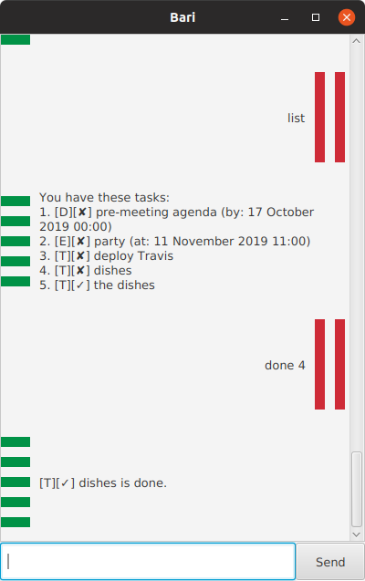

# Bari user guide

**Bari** is a simple chatbot that can keep track of tasks for you.
Enter a command and your task list will be updated automatically – less fuss than
using some other application for a notepad and having to manually update each and
every aspect of the tasks as they come and are done.

The name is that of an Italian city, known for its pasta, its Adriatic coast and
Saint Nicholas. 

## Features 

* Minimalistic user interface
* Support for to-dos, events and deadlines
* Support for finding and sorting tasks
* Auto-saving of tasks after each command
* Export and import of tasks, saved in `tasks.txt` in the same folder
as the application

## Commands

`todo [description]`  
`event [description] /at [time]`  
`deadline [description] /by [time]`

Add a task of the corresponding type to the task list. Bari will display
the task you have just entered, followed by the number of tasks in the list
after that addition.

`time` is a full date and time in the format `day#/month#/yyyy hhmm`, e.g.
`1/4/2019 1201` means 1 April 2019, 12:01. Bari will display dates in this "natural" format
in the user interface.

----

`done [index]`

Mark the task at the given index in the task list as done. Marking a task already done
has no effect; in any case Bari will show you which task you just marked as done.

The index of a task is between 1 and _n_ inclusive, where _n_ is the number of tasks
in the task list. An error will be raised if the provided index is non-numeric
or outside this range. 

----

`delete [index]`

Delete the task at the given index in the task list. Bari will display the task that was
just deleted, so you may enter it again if the deletion was by mistake.

The permissible values of the index are the same as for the `done` command.

----

`list`

Get Bari to list out all the tasks in your task list. This list will be preceded by the
number of tasks and will display the corresponding index numbers beside each task.

----

`find [string]`

Find which tasks contain the given string (case-sensitive) and show them. As with `list`,
the number of matching tasks will be displayed before the list proper.

----

`sort`

Quietly sort all tasks by task type, then done status, then description.
_Quiet_ means that Bari will only tell you that the tasks have been sorted;
the `list` command then needs to be used to explicitly display them.

----

`exit`

Exit the application. Bari is kind enough to say "Bye!" and keep the window open long
enough for you to see that message before finally disappearing into the background.
